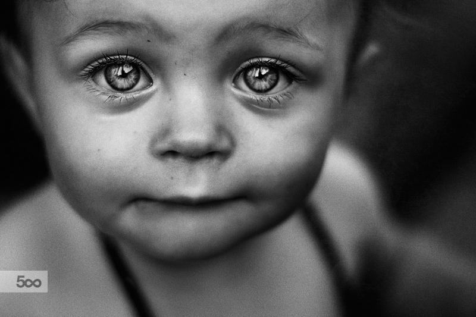

<p>
  
  
  
  
  
  
  
  
  
</p>
<div align="center">


# Image Colorization

</div>

## How it works?

**Clone the repository; install dependencies**

```
git clone https://github.com/BEPb/Image_Colorization.git
pip install requirements.txt
```

**Colorize!** This script will colorize an image. The results should match the images in the `imgs_out` folder.

```
python main_colorize.py -i imgs_in/1.jpg
```


<div align="center">


</div>

<div align="center">


</div>

<div align="center">


</div>

<div align="center">


</div>

<div align="center">


</div>

<div align="center">


</div>

<div align="center">


</div>
